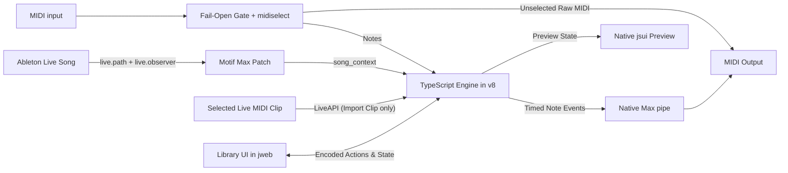

# Motif for Max for Live


Motif is a scale-aware MIDI phrase launcher for Ableton Live. Play a note to trigger a saved phrase starting from that pitch and Motif can preserve the phrase's exact intervals or adapt it to the Live Set's current scale. It is designed for performance, variation, and quickly turning MIDI clips into a reusable phrase library.

## Use Cases

- Play complete melodies, arpeggios, fills, and rhythmic figures from a single MIDI note.
- Reuse one phrase in different keys and scales without editing the original notes.
- Build performance zones where different keys select or immediately trigger specific motifs.
- Import ideas from Live MIDI clips, refine the parameters in the editor, and save them as JSON motifs.
- Create variations in real time with inversion, reversal, launch quantization, meter fitting, and tempo multiplication.

## Features

- **Scale-aware pitch mapping.** Choose the motif's saved pitch mode or override it with Scale, Chromatic, or Hybrid playback.
- **Live Set synchronization.** Tempo, Current Scale, time signature, transport, and song position follow Live automatically.
- **Visual preview.** See note timing, duration, contour, and resulting note names before playing the phrase.
- **Non-destructive transforms.** Invert pitch offsets or reverse note timing without changing the saved motif.
- **Performance controls.** Configure trigger lifecycle, launch quantization, hold-repeat rounding, retrigger behavior, trigger zone, MIDI pass-through, meter handling, and a device-local BPM multiplier.
- **Library and authoring window.** Search nested folders, filter by tags, import the selected Live MIDI clip, edit motif properties and individual notes, and save user motifs.
- **MIDI hot keys.** Assign a note to play a particular motif immediately or select it for later trigger-zone notes.
- **Safe MIDI routing.** Non-note MIDI passes through unchanged, notes can pass according to the selected policy, and Panic clears scheduled events and releases held notes.
- **Live Set recall.** Device parameters, motif selection, hot-key assignments, and the chosen library folder are restored with the saved Ableton Live Set.

### Pitch Modes

| Mode      | Behavior                                                                         |
| --------- | -------------------------------------------------------------------------------- |
| Scale     | Stores scale-degree movement and maps it through Live's current scale.           |
| Chromatic | Preserves exact semitone offsets and ignores Live's current scale.               |
| Hybrid    | Maps scale degrees while retaining chromatic alterations from the source phrase. |

The device's **Motif** pitch choice uses the mode saved with the selected phrase. Scale and Hybrid motifs also retain their source root, scale, intervals, and anchor so conversion does not depend on whichever target scale happens to be active later.


## Installation

Motif requires Ableton Live 11 or later with Max for Live. Live 11's note API is required for MIDI clip import.

1. Download `Motif.amxd` into your Ableton User Library, or keep it anywhere Live can access.
2. Drag **Motif** onto a MIDI track before an instrument.
3. Play a note in the trigger zone. The default zone is MIDI notes 36–84 (C1–C5 using Live's octave names).

The two built-in motifs work immediately. To use your own library, open **Info**, choose a folder for motif JSON files, and use **Import Clip** or edit a built-in motif to create a user copy. Clip import reads the MIDI clip open in Detail View, falling back to the highlighted MIDI clip slot.

---

## Development

### Prerequisites

- Node.js v26
- `npm`
- Ableton Live with Max for Live for device packaging and in-host testing

Install dependencies and build the generated Max assets:

```bash
npm install
npm run build
```

The build reads the built-in motif JSON and the TypeScript, HTML, CSS, and preview sources, then writes:

| Output File                   | Purpose                                                                                                        |
| ----------------------------- | -------------------------------------------------------------------------------------------------------------- |
| `src/generated/builtins.ts`   | Generated TypeScript representation of `motifs/builtin/*.json`, the built in Motifs.                           |
| `max/Motif.maxpat`            | Complete generated Max patch with the current runtime filenames.                                               |
| `max/motif-device-<hash>.js`  | Minified TypeScript engine for Max's `v8` object, powers the library and playback.                             |
| `max/motif-preview-<hash>.js` | Minified ES5-compatible renderer for Max's `jsui` object for the note preview in Ableton.                      |
| `max/library.html`            | Self-contained production Library page used for inspection and validation and embedded into the engine bundle. |

Runtime JavaScript filenames are derived from their content. A normal build removes stale hashes; use `npm run clean && npm run build` when you want to recreate every generated artifact.

`max/Motif.amxd` is preserved because only Max can write the packaged device container.

### Library UI Workbench

Run the production Library UI in a browser for easier testing and development without opening Live or Max:

```bash
npm run dev:library
```

The workbench loads the actual code from `src/max/library/ui/` inside a resizable viewport and supplies a simulated `window.max` bridge. The fixtures cover normal, editing, large-note-table, long-content, scanning, empty-library, and warning states. Authoring actions are handled locally and shown in the action log.

Viewport and sidebar changes are previewed immediately. **Save to JSON** writes the selected dimensions and constraints to `config/library-window.json` that the Max patch generator reads for the floating patcher and `jweb` layout. Run `npm run build` afterward to update the production artifacts.


### How Motif Interacts with Max and Ableton Live



#### Song State

The patch observes nine Live `Song` properties with native `live.path live_set` and `live.observer` objects:

- tempo
- root note
- scale mode
- scale intervals
- scale name
- time-signature numerator
- time-signature denominator
- transport state
- current song time

Root and scale also update the read-only device displays directly. Each value is normalized to `song_context <property> <value...>`, and passed through `deferlow`, and sent to the TypeScript engine for compilation, MIDI scheduling calculations, and note preview generation.

Continuous host synchronization deliberately stays in native Max objects. This keeps the visible host state independent of the JavaScript engine and avoids polling or maintaining a persistent JavaScript `LiveAPI` object. `LiveAPI` is created only when **Import Clip** needs `get_notes_extended` for the currently selected MIDI clip.

#### MIDI & Scheduling

`midiin` starts on a fail-open path, so MIDI reaches the next device while the engine initializes. After the engine emits `status Ready`, `midiselect @ch all @note all` sends notes to the engine while controllers, pitch bend, pressure, program changes, and other unselected MIDI bytes continue directly to `midiout`.

The TypeScript engine resolves trigger behavior, compiles motif notes, and emits `event <pitch> <velocity> <channel> <delayMs>`. Native Max `pipe`, `midiformat`, and `midiflush` handle timed output and cleanup. This division keeps pitch and phrase logic testable in TypeScript while leaving time-critical event delivery to Max.

#### Library, Note Preview, and Persistence

The Library uses `jweb` because I found the Motif search & editing are better represented as a structured browser UI. The build embeds its self-contained HTML in the engine and at runtime the engine materializes that page in Max's temporary folder and loads it with `jweb readfile`, so the frozen device does not require a separate HTML dependency. Library state is URL-encoded and split into bounded chunks before crossing the Max-to-browser message boundary.

The compact device preview stays in native `jsui` / MGraphics rather than HTML, avoiding a web renderer in Live's device chain. User-facing controls are parameter-enabled `live.*` objects so Live owns automation and Set recall. Stable motif IDs, MIDI hot keys, and the user-library path are stored in hidden `pattr` blobs rather than menu indexes.

The Max runtime exposes one global handler, `anything()`, which forwards `messagename` and `arrayfromargs(arguments)` to the engine's typed `dispatch()` function. Keeping this bridge outside the bundled IIFE is necessary because Max cannot discover bundler-scoped selector functions. Content-addressed runtime filenames ensure that rebuilding produces a new Max dependency instead of silently reusing cached JavaScript with an older filename.

### Updating the Packaged Device

`npm run build` generates a `.maxpat`, not a distributable `.amxd`. To move a build into the packaged device:

1. Keep `max/Motif.maxpat` and its two referenced hashed JavaScript files together.
2. Open `max/Motif.amxd` in Live and choose **Edit in Max**.
3. Unlock both patchers.
4. Select everything in `max/Motif.maxpat` and copy
5. Select everything in `max/Motif.amxd` and delete, then paste what we copied to replace the packaged device's objects with the contents of `Motif.maxpat` and save in Max.
6. Remove and re-add the device in Live. Confirm that the preview renders, Live's scale updates, the engine reaches `Ready`, and MIDI reaches the following instrument.
7. [Freeze and save the device](https://docs.cycling74.com/userguide/m4l/live_freezing/) so Max embeds the exact hashed dependencies.
8. Run `npm run verify:release` before distribution.

Do not rename `Motif.maxpat` to `.amxd`, and do not replace JavaScript under an existing filename while the device is open. Rebuild and use the newly generated patch and hashes together.

### Verification & Utilities

| Command                                                       | Purpose                                                                                                  |
| ------------------------------------------------------------- | -------------------------------------------------------------------------------------------------------- |
| `npm run check`                                               | Type-check the device, Library UI, and workbench TypeScript projects.                                    |
| `npm run test:unit`                                           | Run the fast unit suite without a production build or coverage.                                          |
| `npm test`                                                    | Build and run the full test suite with coverage.                                                         |
| `npm run validate:max`                                        | Validate the generated patch graph, UI bounds, handlers, dependencies, and embedded Library output.      |
| `npm run verify`                                              | Format, lint, type-check, build, test, execute the compiled runtime in a VM, and validate the Max patch. |
| `npm run verify:release`                                      | Run the full verification suite and inspect the packaged `.amxd`.                                        |
| `npm run midi:import -- input.mid output.json`                | Convert a Standard MIDI File to a Chromatic motif.                                                       |
| `npm run midi:export -- input.json output.mid [triggerPitch]` | Render a motif to a Standard MIDI File; the trigger pitch defaults to MIDI 60.                           |

### Repository Layout

| Path                        | Contents                                                                             |
| --------------------------- | ------------------------------------------------------------------------------------ |
| `src/core/`                 | Pure motif transformation, timing, pitch mapping, compilation, and preview logic.    |
| `src/library/`              | Motif validation, authoring, tags, and in-memory storage.                            |
| `src/max/`                  | Max runtime, Live API boundary, playback controller, Library bridge, and Library UI. |
| `scripts/`                  | Build, Max patch generation / validation, cleanup, and MIDI conversion tools.        |
| `motifs/builtin/`           | Built-in motif JSON files compiled into the device.                                  |
| `schemas/motif.schema.json` | Motif v1 JSON Schema.                                                                |
| `tests/`                    | Unit, integration, generated-patch, browser UI, and runtime contract tests.          |
| `docs/`                     | Focused installation, debugging, and Max API reference notes.                        |

### Additional Technical References

- [Max object, JavaScript, jweb, and Live API inventory](docs/MAX-DOCUMENTATION.md)
- [Host Synchronization Debugging](docs/HOST-SYNC.md)
- [MIDI Routing Debugging](docs/MIDI-DEBUG.md)
- [UI Debugging](docs/UI-DEBUG.md)
- [Motif JSON Schema](schemas/motif.schema.json)
